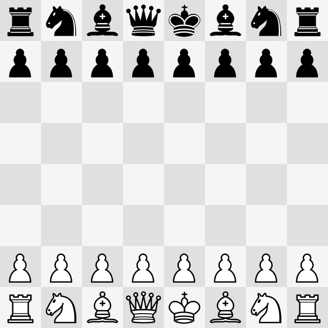

# SwiftChessTools

SwiftChessTools is an independent Swift package for reusable chess rules,
notation, and SwiftUI board UI that can support multiple future apps.

- `ChessCore`: core chess model, rules, and notation code.
- `ChessUI`: reusable SwiftUI chessboard UI built on `ChessCore`.

## Requirements

SwiftChessTools uses Swift tools 6.1 and supports Swift 5 and Swift 6 language
modes. The package currently declares these platform minimums:

- iOS 17+
- macOS 14+

## Installation

After the initial public release is tagged, add SwiftChessTools to your package
dependencies:

```swift
dependencies: [
    .package(
        url: "https://github.com/Trickfest/SwiftChessTools.git",
        from: "1.0.0"
    ),
]
```

Then depend on the product or products your target needs:

```swift
targets: [
    .target(
        name: "YourApp",
        dependencies: [
            .product(name: "ChessCore", package: "SwiftChessTools"),
            .product(name: "ChessUI", package: "SwiftChessTools"),
        ]
    ),
]
```

For local development in a sibling checkout, use a path dependency instead:

```swift
.package(path: "../SwiftChessTools")
```

## Package Products

```swift
.product(name: "ChessCore", package: "SwiftChessTools")
.product(name: "ChessUI", package: "SwiftChessTools")
```

## ChessCore Quick Start

Use `ChessCore` when you need rules, positions, legal moves, and notation
without any SwiftUI dependency:

```swift
import ChessCore

let startingFEN = "rnbqkbnr/pppppppp/8/8/8/8/PPPPPPPP/RNBQKBNR w KQkq - 0 1"

let fenSerializer = FENSerializer()
let game = Game(position: try fenSerializer.position(from: startingFEN))

let move = try Move(string: "e2e4")

if game.legalMoves.contains(move) {
    game.apply(move: move)
}

let updatedFEN = fenSerializer.fen(from: game.position)
let legalReplies = game.legalMoves.map(\.description)
```

FEN, SAN, and coordinate-move parsing APIs are throwing entry points:

```swift
do {
    let position = try FENSerializer().position(from: startingFEN)
    let coordinateGame = Game(position: position)
    let sanGame = Game(position: position)
    let coordinateMove = try Move(string: "g1f3")
    let sanMove = try SANSerializer().move(for: "e4", in: sanGame)
    coordinateGame.apply(move: coordinateMove)
    sanGame.apply(move: sanMove)
} catch let error as FENParsingError {
    // Handle malformed FEN.
} catch let error as SANParsingError {
    // Handle SAN that does not identify exactly one legal move.
} catch let error as MoveParsingError {
    // Handle malformed coordinate notation.
} catch {
    // Handle any other error.
}
```

## ChessUI Quick Start

Use `ChessUI` when you want a reusable SwiftUI board. The view reports moves;
your app decides whether to apply them, update state, ask an engine for a
reply, or reject the move.



```swift
import SwiftUI
import ChessCore
import ChessUI

private let startingFEN =
    "rnbqkbnr/pppppppp/8/8/8/8/PPPPPPPP/RNBQKBNR w KQkq - 0 1"

struct BoardDemoView: View {
    @State private var model = ChessBoardModel(fen: startingFEN)

    var body: some View {
        ChessBoardView(model: model)
            .onMove { move, isLegal, _, _, _, promotion in
                guard isLegal else { return }

                let appliedMove = promotion.map {
                    Move(from: move.from, to: move.to, promotion: $0)
                } ?? move

                model.game.apply(move: appliedMove)

                let fen = FENSerializer().fen(from: model.game.position)
                model.setFEN(fen, animatedMove: appliedMove)
            }
            .frame(width: 320, height: 320)
    }
}
```

`Examples/ChessWorkbench` is the runnable integration example for these APIs.
`ChessBoardModel.setFEN(_:animatedMove:)` returns `false` and records
`fenError` when a FEN update fails, leaving the current board unchanged.

## Scope

SwiftChessTools provides:

- Board state, pieces, moves, legal move generation, FEN, and SAN helpers.
- A reusable SwiftUI chessboard with piece assets, move interaction,
  highlighting, hints, promotion UI, and board perspective support.
- A small macOS workbench and automated tests for package behavior.

SwiftChessTools does not provide:

- A chess engine, AI opponent, Stockfish integration, or analysis UI.
- PGN import/export, opening books, clocks, online play, accounts, or sync.

## Manual Workbench

`Examples/ChessWorkbench` is a small macOS SwiftUI app for manually exercising
`ChessCore` and `ChessUI` from inside this package. It renders a real
`ChessBoardView`, lets you edit the current FEN, applies legal board moves, and
exposes quick controls for reset, hints, board sizing, and promotion UI.

Open the app in Xcode:

```sh
open Examples/ChessWorkbench/ChessWorkbench.xcodeproj
```

Select the `ChessWorkbench` scheme and run it on My Mac.

Command-line build:

```sh
xcodebuild -project Examples/ChessWorkbench/ChessWorkbench.xcodeproj \
  -scheme ChessWorkbench \
  -configuration Debug \
  -destination 'platform=macOS,arch=arm64' \
  -derivedDataPath .build/xcode-chess-workbench \
  build
```

Manual smoke test:

1. Launch the app.
2. Confirm the board renders from the starting FEN.
3. Drag a legal move on the board.
4. Confirm the FEN field updates.
5. Try `Reset`, `Hint`, and `Show Promotion Picker`.

## Testing

Run all automated tests from the repository root:

```sh
Scripts/test-all.sh
```

The script runs the SwiftPM test suite, the simulator-backed `ChessUIHarness`
XCUITest suite, and the macOS `ChessWorkbench` UI tests. To use a different
simulator or macOS destination, set `IOS_DESTINATION` or `MACOS_DESTINATION`.

Run the package test suite from the repository root:

```sh
swift test
```

Run the same suite with SwiftPM coverage enabled:

```sh
swift test --enable-code-coverage
```

ChessUI has macOS-rendered snapshot tests checked in under
`Tests/ChessUITests/SnapshotReferences`. To intentionally refresh those
references:

```sh
RECORD_CHESSUI_SNAPSHOTS=1 swift test --filter ChessUISnapshotTests
```

The simulator-backed ChessUI harness exercises the real SwiftUI board through
XCUITest:

```sh
xcodebuild -project Tests/ChessUIHarness/ChessUIHarness.xcodeproj \
  -scheme ChessUIHarness \
  -configuration Debug \
  -destination 'platform=iOS Simulator,name=iPhone 17 Pro' \
  -derivedDataPath .build/xcode-harness \
  -clonedSourcePackagesDirPath .build/xcode-harness/SourcePackages \
  test
```

The macOS `ChessWorkbench` UI tests drive the package's example app directly:

```sh
xcodebuild -project Examples/ChessWorkbench/ChessWorkbench.xcodeproj \
  -scheme ChessWorkbench \
  -configuration Debug \
  -destination 'platform=macOS,arch=arm64' \
  -derivedDataPath .build/xcode-chess-workbench \
  -clonedSourcePackagesDirPath .build/xcode-chess-workbench/SourcePackages \
  test
```

## Acknowledgements

SwiftChessTools is MIT licensed and independent from the GPL-licensed
`StockfishEmbedded` sibling project.

This project draws significant inspiration from
[ChessKit](https://github.com/aperechnev/ChessKit) by Alexander Perechnev and
[ChessboardKit](https://github.com/rohanrhu/ChessboardKit) by Rohan R. H. U.
Early versions incorporate ideas and implementation approaches from those
projects. This repository is independent and is not affiliated with or endorsed
by the original maintainers.

See `NOTICE.md` for preserved MIT license notices.

## Roadmap

See `ROADMAP.md`.
